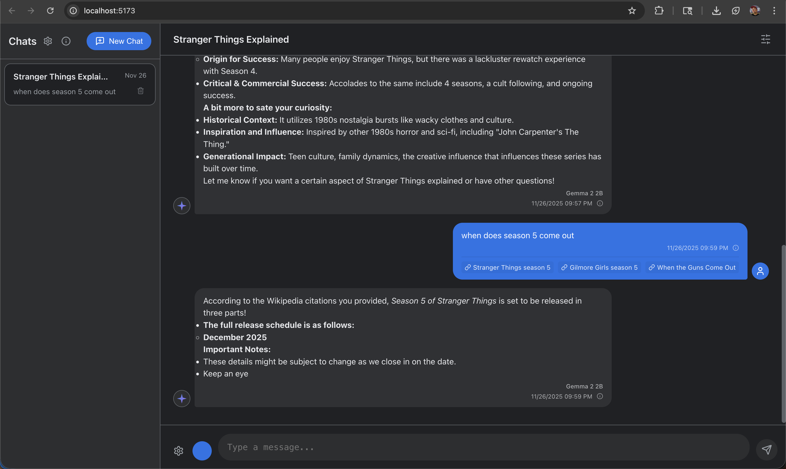

```text
 __      __      _      _    _     __  __    ___ _           _   
 \ \    / /___  | |__  | |  | |   |  \/  |  / __| |_   __ _ | |_ 
  \ \/\/ // -_) | '_ \ | |__| |__ | |\/| | | (__| ' \ / _` ||  _|
   \_/\_/ \___| |_.__/ |____|____||_|  |_|  \___|_||_|\__,_| \__|
Secure, Private AI running entirely in your browser.
```



Web LLM Chat is a modern, secure chat application that runs Large Language Models (LLMs) directly in your browser. Unlike traditional AI services, your chat data never leaves your device. The model runs locally using WebGPU, ensuring complete privacy and security for your conversations.

## ✨ Features
🔒 Privacy First: All processing happens locally on your machine via WebGPU. Your data never touches a server.

🧠 Model Selection: Choose from variety of optimized models (e.g., Llama 3, Gemma 2) directly from the UI.

🌐 Web Search Capability: Toggle the globe icon to enable real-time information fetching from Wikipedia or Google.

💾 Data Control: Export chat history to JSON or import previous conversations. You have full ownership of your data.

🎭 Custom Personas: Set a global system prompt in Settings, or override it for specific chats to give the AI a unique personality or role.

## 🛠 Installation
To run Web LLM Chat locally on your machine:


```Bash

git clone https://github.com/geekpunk/webllmconsole.git
cd webllmconsole

npm install
npm run dev
```
Open in Browser: Navigate to http://localhost:8000 in your WebGPU-supported browser.

## 🚀 How to Use
### Select a Model: Use the selector in the chat header to choose a model.

Tip: The first time you select a model, it will download to your device. This may take a few moments depending on your internet speed. It is cached for future use.

Start Chatting: Type your message and press send. The AI responds instantly, running entirely on your computer's GPU.

Web Search: Click the globe icon to toggle web search for answers requiring up-to-date real-world data.

Manage Data: Access the Settings menu to manage your chat history or configure system prompts.

## ⚡ Powered By
This project makes use of the incredible work done by the MLC AI team.

WebLLM: https://webllm.mlc.ai/

# 🤖 Development Story
This entire application was created with Google Gemini 3 & Antigravity. No code was written by a human to make this outside of prompting.

📄 License
This project is licensed under the MIT Open Source License.

👤 Author
Mike Wolf